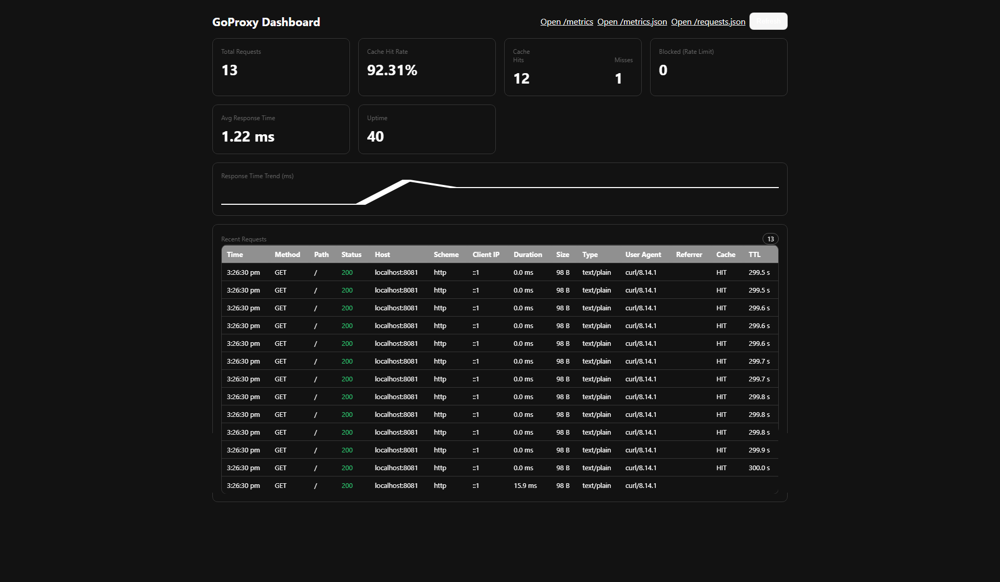

# GoProxy – fast reverse proxy with caching, rate limiting and metrics



GoProxy is a small reverse proxy written in Go. It caches GET responses, applies per‑IP rate limiting, and exposes Prometheus‑style metrics and a simple UI.

## What Does GoProxy Do?
GoProxy sits between clients and your backend service, helping by:

- Making things faster – caches repeat GET responses
- Protecting against overload – rate limits requests per IP
- Keeping track of usage – exposes Prometheus and JSON metrics
- Adding safety – hides your backend behind a single entry point

## Key Features

### 🚀 Speed Boost
- Smart caching: serves repeat GET responses instantly (configurable TTL)
- High performance: built with Go

### 🛡️ Protection
- Rate limiting: per‑IP requests/minute
- Request shaping: easy place to add future rules

### 📊 Monitoring
- Prometheus metrics at `/metrics`
- JSON metrics at `/metrics.json`
- Health checks at `/health`

### 🔧 Easy to Use
- One‑click Windows scripts
- Docker Compose
- Cross‑platform Go builds

## Requirements
- Go 1.21+
- Windows, macOS or Linux
- Optional: Docker + Docker Compose

## Quick Start Guide

### 🪟 Windows (one‑click)
Use the included scripts:

```bat
run.bat         # builds both binaries, starts backend on :8081 and proxy on :8080
stop.bat        # stops both processes
```

Change proxy port:

```bat
run.bat 9090    # proxy starts on :9090
```

After startup:
- Proxy: `http://localhost:8080` (or chosen port)
- Health: `http://localhost:8080/health`
- UI: `http://localhost:8080/` (landing)
- Metrics: `http://localhost:8080/metrics`

### Option 1: Docker

```bash
docker-compose up

# Or run in background (recommended)
docker-compose up -d
```

This will start:
- Proxy server: `http://localhost:8080`
- Test backend server: `http://localhost:8081`
- (If configured) monitoring stack

### Option 2: Manual Installation

#### Step 1: Install Go
- Windows: download from `https://golang.org/dl/`
- macOS: `brew install go` or download
- Linux: use your package manager (e.g. `sudo apt install golang-go`)

#### Step 2: Build the project
```bash
go mod tidy
go build -o goproxy main.go
go build -tags testserver -o test_server test_server.go
```

#### Step 3: Run the servers
```bash
./test_server                                 # terminal 1 (listens on :8081)
./goproxy -backend http://localhost:8081      # terminal 2 (serves on :8080)
```

## How to Use GoProxy

### Basic Usage
Once running, GoProxy will be available at `http://localhost:8080`.

1. Access your backend: requests to `/proxy/` are forwarded to the backend
2. Check health: `GET /health`
3. View metrics: `GET /metrics` or `GET /metrics.json`
4. Open UI dashboard: `GET /` (landing)

### CLI Flags
```text
-port           string        proxy listen port (default "8080")
-backend        string        backend base URL (default "http://localhost:8081")
-rate-limit     int           requests per IP per minute (default 100)
-cache-ttl      duration      TTL for cached GET responses (default 5m)
```

Example:

```bash
./goproxy -port 9000 -backend https://example.com -rate-limit 200 -cache-ttl 10m
```

### Endpoints
- `/`                UI landing
- `/health`          liveness check
- `/metrics`         Prometheus text metrics
- `/metrics.json`    JSON metrics
- `/proxy/`          reverse-proxy to backend

## Understanding the Metrics

When you visit `/metrics`, you'll see information like this:

```
goproxy_total_requests 150        # Total number of requests handled
goproxy_cache_hits 120           # Requests served from cache (fast!)
goproxy_cache_misses 30          # Requests that had to go to backend
goproxy_blocked_requests 5       # Requests blocked due to rate limiting
goproxy_cache_hit_rate 80.00     # Percentage of requests served from cache
```

What this tells you:
- High cache hit rate (e.g., 80%+) means the cache is effective
- Low blocked requests means rate limits are reasonable
- Increasing total requests shows usage trends

## Common Use Cases

### 1) Website Performance
Use GoProxy in front of your website to:
- Speed up page loads with caching
- Reduce load on your main server
- Protect against traffic spikes

### 2) API Protection
Place GoProxy in front of your API to:
- Limit how many requests each user can make
- Cache frequently requested data
- Monitor API usage patterns

### 3) Development Testing
Use GoProxy during development to:
- Test how your app handles high traffic
- Simulate real‑world conditions
- Debug performance issues

## Testing Your Setup

### Quick Test (Windows)
Run the built‑in test script to verify everything works:

```bat
test.bat
```

### Manual Testing
```bash
# Test health endpoint
curl http://localhost:8080/health

# Test proxy (should return backend response)
curl http://localhost:8080/proxy/

# Test caching (second request should be faster)
curl http://localhost:8080/proxy/

# Check metrics
curl http://localhost:8080/metrics
```

## Troubleshooting

### Common Issues

"Port already in use"
- Another program is using the same port
- Solution: use a different port with `-port 9090` or run `stop.bat` first on Windows

"Backend not reachable"
- Your backend server isn't running
- Solution: start your backend server first (or use bundled `test_server`)

"High memory usage"
- Cache is storing too much data
- Solution: reduce cache TTL with `-cache-ttl 1m`

### Docker Issues

"go.sum not found" during Docker build
- The Dockerfiles handle dependencies automatically
- Use the updated Dockerfiles (already included)

"Docker containers not starting"
- Check if ports 8080 and 8081 are available
- Stop any services using these ports or modify `docker-compose.yml`

### Getting Help
- Check logs for error messages
- Verify your backend server is running
- Test with built‑in test scripts
- Check the metrics endpoint for clues

## Configuration Examples

### For Development
```bash
./goproxy -port 8080 -backend http://localhost:3000 -rate-limit 1000 -cache-ttl 1m
```
- High rate limits for testing
- Short cache time for fresh data

### For Production
```bash
./goproxy -port 80 -backend https://my-production-site.com -rate-limit 50 -cache-ttl 10m
```
- Lower rate limits for security
- Longer cache time for performance

### For High Traffic
```bash
./goproxy -port 443 -backend https://my-busy-site.com -rate-limit 500 -cache-ttl 30m
```
- Higher rate limits for busy sites
- Long cache time for maximum performance

## What's Inside GoProxy?

### 🔄 Proxy Component
- Handles incoming web requests
- Forwards them to your backend server
- Captures responses for caching

### 💾 Cache Component
- Stores responses in memory
- Automatically removes expired entries
- Makes repeat requests fast

### 🚦 Rate Limiter
- Tracks requests per IP
- Blocks clients who exceed the limit
- Protects your server from overload

### 📈 Metrics Component
- Counts requests, cache hits, etc.
- Provides performance statistics
- Helps you understand usage patterns

## Performance Tips

### For Best Performance
1. Use appropriate cache TTL: longer for static content, shorter for dynamic
2. Set reasonable rate limits: high enough for normal use, low enough to prevent abuse
3. Monitor metrics: watch cache hit rates and response times
4. Scale horizontally: run multiple proxy instances for high traffic

### Memory Usage
- Cache size depends on TTL and request volume
- Monitor memory usage in production
- Adjust cache TTL if memory usage is too high

## Security Considerations

### Rate Limiting
- Prevents abuse and DoS attacks
- Configurable per your needs
- Tracks by IP address

### Headers
- Adds proxy identification headers
- Preserves original request information
- Can be customized for your needs

## Getting Started Checklist

- [ ] Install Go (if not using Docker)
- [ ] Download and build GoProxy
- [ ] Start your backend server
- [ ] Start GoProxy
- [ ] Test the health endpoint
- [ ] Test proxy functionality
- [ ] Check metrics
- [ ] Configure for your needs

## Contributing
1. Fork the repository
2. Make your changes
3. Test thoroughly
4. Submit a pull request

## License
MIT
